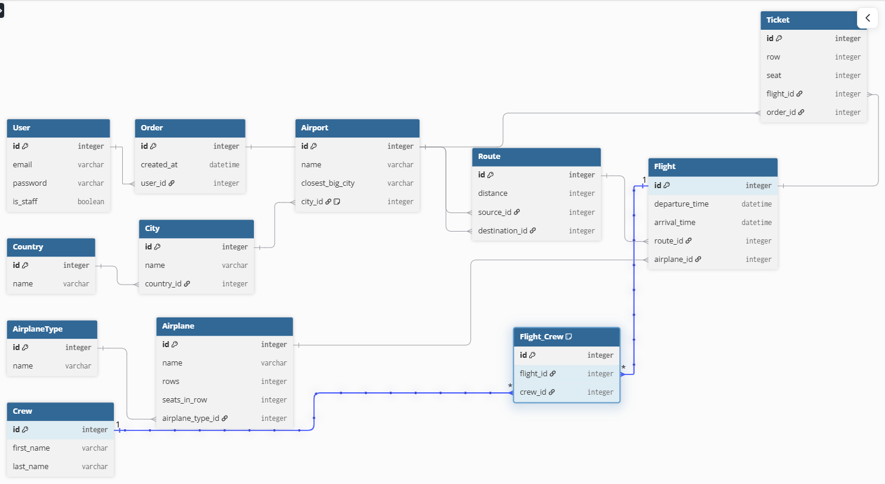
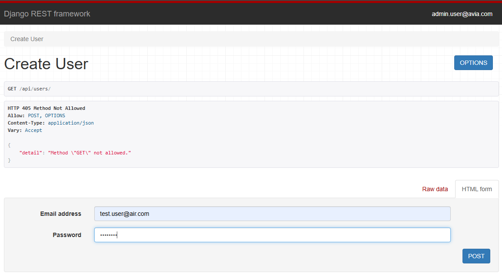
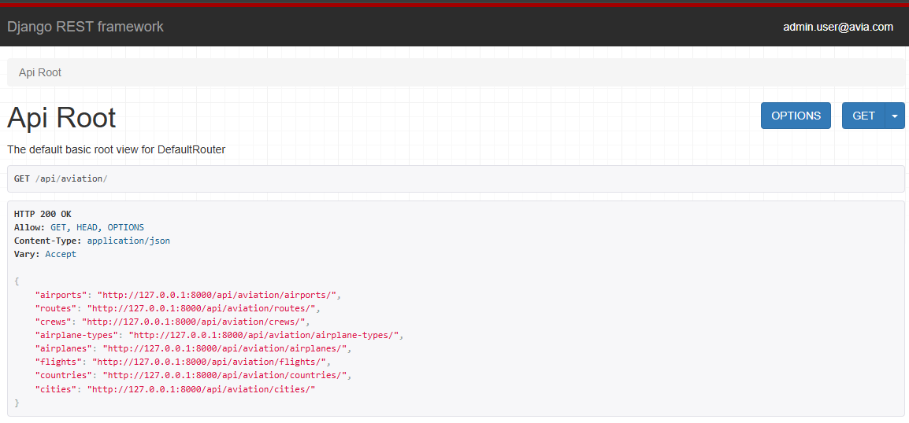
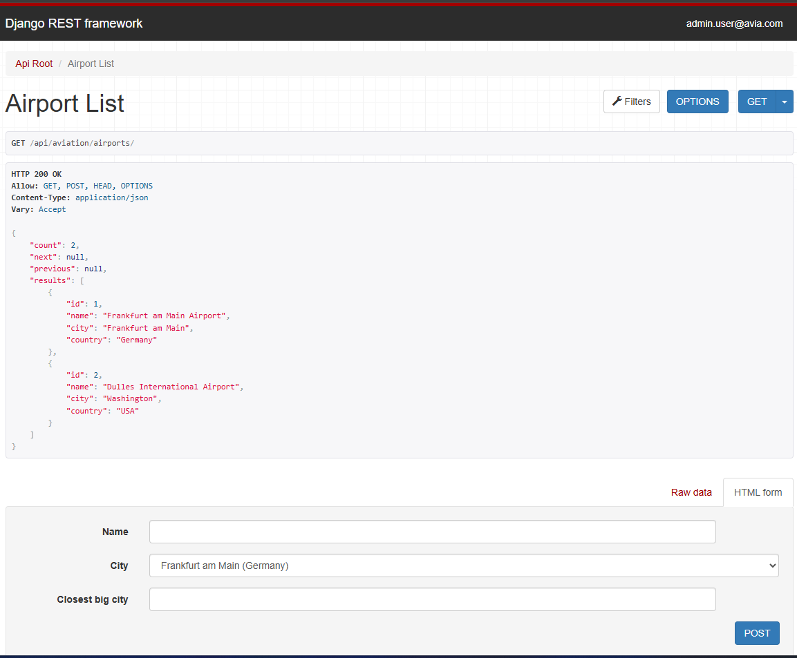
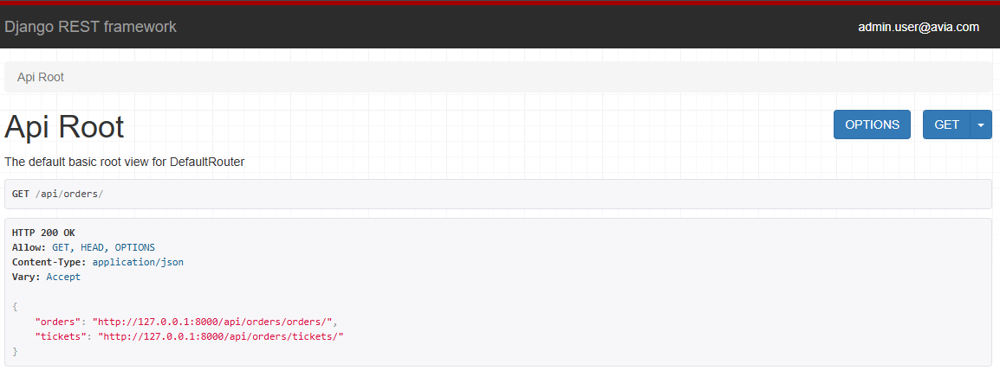

# Airport Management Service API

A comprehensive REST API service built with Django REST Framework for managing airline infrastructure, flights, routing, and ticket bookings. 

## 🚀 Features

* **Authentication & Authorization:** Secure JWT (JSON Web Token) authentication. Role-based access control (Admins can manage data, authenticated users have read-only access and can create orders).
* **Advanced Flight Search:** Robust filtering, searching, and ordering functionality (e.g., search flights by airplane name, filter by departure city, order by departure time) using `django-filter`.
* **Custom Pagination:** Implemented custom flexible pagination, allowing clients to control the page size via query parameters.
* **Atomic Transactions:** Secure order and ticket creation process. Tickets are created simultaneously with the order using `transaction.atomic()` to ensure data integrity and prevent race conditions.
* **Database Optimization:** Minimized database hits using `select_related` and `prefetch_related` in viewsets to avoid the N+1 query problem.
* **Custom Geography Logic (Bonus):** Extended the base requirement by introducing `Country` and `City` models, creating a more realistic hierarchical relationship for `Airport` locations while maintaining backward compatibility with the `closest_big_city` field.

## 🐳 Installation & Local Setup (Docker)

The most convenient way to run this project is using Docker. Ensure you have Docker and Docker Compose installed on your machine.

1. **Clone the repository:**
    ```bash
    git clone https://github.com/Sergio-zt/Airport-management-service
    cd Airport-management-service
    ```
2. **Set up Environment Variables:**
Create a .env file in the root directory and add your database credentials:
    ```bash
    POSTGRES_DB=airport_db
    POSTGRES_USER=admin
    POSTGRES_PASSWORD=supersecretpassword
    POSTGRES_HOST=db_host
    POSTGRES_PORT=5432
    ```

3. **Build and Run the Containers:**
    ````bash
    docker-compose up --build
    ```

4. **Create a Superuser (Admin account):**
Open a new terminal window and run:
    ```bash
    docker-compose exec aviation python manage.py createsuperuser
    ```

5. **Access the API:**
The API is now available at http://127.0.0.1:8000/api/

To interact with the API, you need to authenticate using JWT:

Register a new user at POST /api/users/register/ or use the superuser credentials.

Obtain an access token at POST /api/users/token/ by sending your email and password.

Include the token in the HTTP header for subsequent requests:
Authorization: Bearer <your_access_token>

🗄️ Database Structure
The database schema diagram can be found here:





